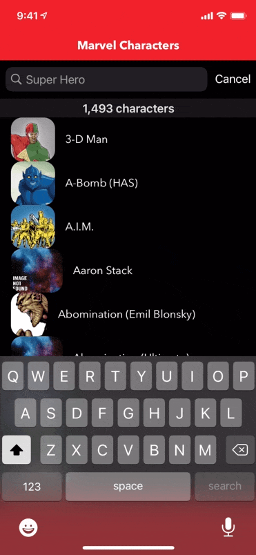
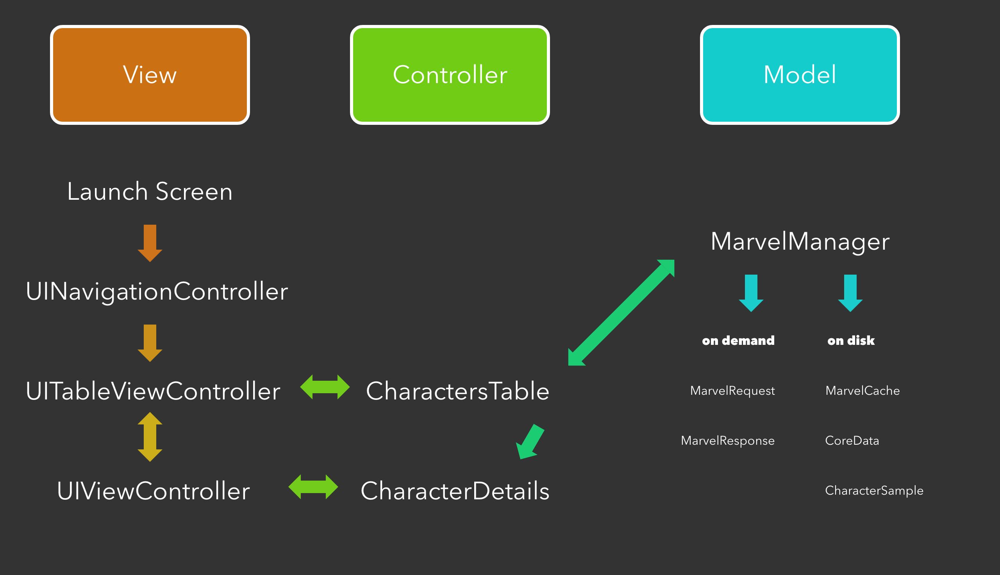

## Marvel Coding Exercise

A user should be able to search for their favorite Marvel characters and see detailed info and images about those characters.

 

## Requirements

- [x] When your app opens, it should display a list of Marvel characters including their picture thumbnail.
- [x] Include a search bar that makes it easier for the user to find their favorite characters.
- [x] Be sure to include infinite scrolling so when you get to the bottom of the list it keeps loading superheroes.
- [x] Build interfaces with Storyboards or XIB files, not purely in code using UIKit.
- [x] Use the Marvel API at https://developer.marvel.com/ as a data source.
- [x] Persist the data that you have already fetched from the server. **(using CoreData)**
- [x] Implement some unit tests or UI tests. **(unit test for online and offline data)**
- [x] Limited use of third party libraries is allowed **(used Reachability by ashleymills, no CocoaPods for install simplicity)**

## Installation

1. Clone repo: https://github.com/philmodin/MarvelCodingExercise.git
2. Open: `MarvelCodingExercise.xcodeproj`
3. Set team and bundle ID.
4. Notice `Keys.plist` is missing. Ignore it and build project, this file will be auto generated.
5. Open `Keys.plist` If you have Public and Private keys for Marvel, paste them here. Otherwise register at: https://developer.marvel.com/
6. Attach device and run the project.
7. If needed, check trusted apps in iPhone device management settings for your developer profile.

## Project Structure

